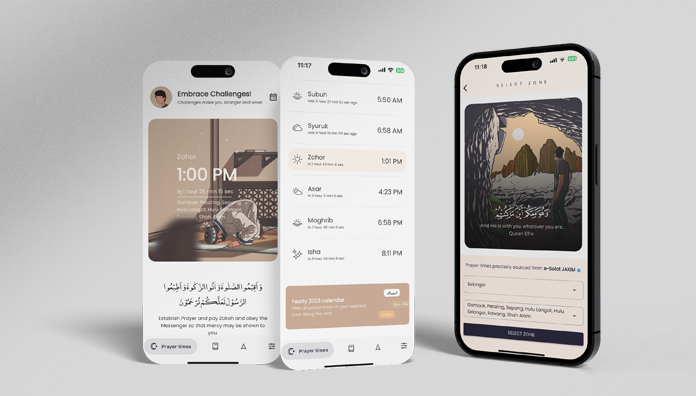

# Najia App

Welcome to Najia App, a Flutter-based mobile application.

## Getting Started

Follow these steps to set up and run the Najia App on your local machine.

### Prerequisites

- Make sure you have Flutter installed. If not, follow the installation guide: [Flutter Installation](https://flutter.dev/docs/get-started/install)

### Project Setup

1. Run the following commands in your terminal to set up the project:

    ```bash
    flutter clean
    flutter pub get
    flutter gen-l10n
    ```

2. Delete the `Runner.xcworkspace` file:

    ```bash
    rm -rf ios/Runner.xcworkspace
    ```

3. Delete the `Podfile.lock` file:

    ```bash
    rm ios/Podfile.lock
    ```

4. Navigate to the `ios` directory and run:

    ```bash
    cd ios
    pod install
    ```

### Xcode Configuration

1. Open Xcode and sign in with the Najia App Studio email account.

2. Build and run the project in Xcode.

### Preview



Feel free to explore and customize the app to suit your needs!

## License

This project is licensed under the [MIT License](LICENSE).
